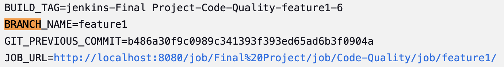
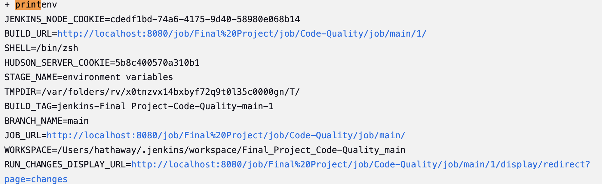
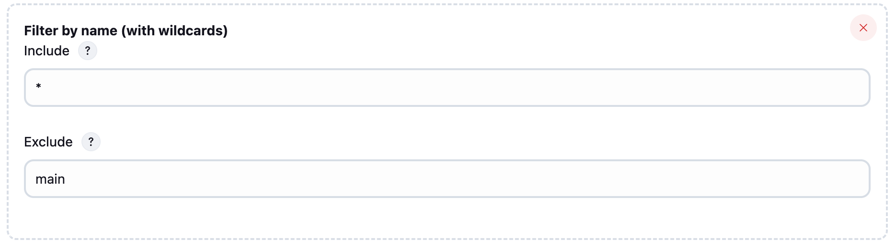

## Pipelines
We have two pipelines:
- **Main Pipeline**: Runs when changes are merged into `main`.
- **Feature1 Pipeline**: Runs on feature branches except `main`.

## About `main`
This pipeline will run for all branches except `main`.  
We are developing a release pipeline that triggers when we commit or push to `main`.  
Once changes are merged into `main`, this pipeline will execute.  
For other pipelines, ensure they are configured not to run on the `main` branch.

## Setting Up Jenkins Multibranch Pipeline
### 1. Install Jenkins & Required Plugins
- Ensure Jenkins is installed.
- Add the **Pipeline** and **Multibranch Pipeline** plugins.

### 2. Create a Multibranch Pipeline Job
- Go to **Jenkins Dashboard** → **New Item**.
- Select **Multibranch Pipeline** and name it.
- Click **OK**.

### 3. Configure SCM (GitHub, GitLab, etc.)
- Under **Branch Sources**, select **Git** or **GitHub**.
- Provide the repository URL and credentials.

### 4. Define the `Jenkinsfile`
- Ensure your repository has a `Jenkinsfile` defining the pipeline stages.

### 5. Set Up Branch Filtering
- In **Advanced** under **Branch Sources**, set:
  - **"Include"** to `*`
  - **"Exclude"** to `main` to prevent builds on the `main` branch.
  

### 6. Save and Apply
- Jenkins will scan the repository and trigger jobs accordingly.

